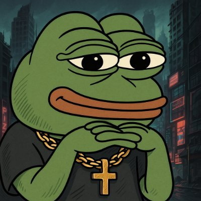

# AL

I build systems that make money while I sleep.

Rust-first. Sub-millisecond execution. Autonomous agents that trade, dev tokens, and hunt alpha. Everything on here I built alone. 50,000+ people cloned my only open source agent. Most of what I run stays private.

---

### CloddsBot — if it has odds, it's trading them

Built in 12 days. Trades autonomously across **1,000+ markets** — Polymarket, Kalshi, Betfair, Hyperliquid, Binance, Solana DEXs, and every major EVM chain (Ethereum, Base, Polygon, Arbitrum, BSC).

My first and only open source agent — everything else stays private. Solo dev.

10,700+ clones in 14 days — zero marketing budget

 

---

BSc International Business & Marketing — Russell Group university. Hackathon winner. Enterprise scholarship.

Building Solanas Deepest Orderbook @ stratabook.org

